# 중고거래 플랫폼 왓슈[WhatSu]
<p> 


</p>
<hr><br>

## 📑 프로젝트 개요
Vue.js를 공부하기 위한 토이 프로젝트 <br>

중고거래의 중앙 물류 센터 필요
- 중고거래시장이 확장되면서 리사이클링 사업에 매우 긍정적임 기존의 중고거래는 개인과 개인의 거래로 이루어져 있음
- 개인과 개인의 중고거래는 중고 시장의 특성상 물건의 가격이 다 같을 수 없다는 단점이 있음
- 또한 직거래가 안될 경우 택배를 이용한 사기가 가장 큰 문제로 다양한 방안으로 보안하는 사례가 존재함 <br><br>

중고거래 시장에서 부각되는 단점을 해결하기 위해 플랫폼 개발 필요
- 쿠x과 같이 중고물품에 대한 물류창고를 통해 기존의 개인과 개인의 거래가 아닌 개인과 플랫폼의 거래로 해결함
- 1인 가구의 증가와 소형평수의 증가에 따라 합리적인 공간에 대한 중요성이 필요함 버리기엔 아깝고 공간을 차지하는 물건을 매입하고 물류창고 역할을 함
- 개인과 플랫폼의 거래를 통해 중고 물건의 시세 평준화와 사기와 같은 범죄 행위를 차단 할 수 있음
<br>

## 📋 프로젝트 흐름도 및 기능
 <br>
판매자는 왓슈에 중고물품 판매 서비스를 신청함 <br>
판매자는 판매할 중고물품을 왓슈에게 전달함 <br><br>

 <br>
왓슈는 판매자에게 받은 신청서와 물건을 확인함 <br>
중고 물품의 검수를 통해 상품의 등록 여부를 정함 <br>
등록이 되면 왓슈의 물류창고에 판매자의 물건을 보관하고 게시글을 올림 <br><br>

 <br>
구매자는 왓슈 플랫폼을 통해 구매할 물건을 확인함 <br>
구매자가 구매할 의사가 있다면 타 쇼핑몰과 같이 대금을 지불함 <br><br>

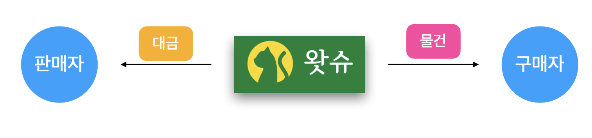 <br>
구매가 완료되면 왓슈는 물류창고에서 보관중인 상품을 구매자에게 보냄 <br>
또한 수수료를 제외한 금액을 판매자에게 입금함 <br><br>

- 게시판 (사던지 말던지)
- 판매 게시판 (팔던지 말던지)
- 문의하기 (궁금해유?) 
- 결제하기 (사는거유?)
- 사용자 (로그인 포함)
- 회원가입 (가입 하던지 말던지)
- 비밀번호 찾기 (찾던지 말던지) 
- 채팅하기 (말 하던지 말던지)
<br>

## 💾 데이터베이스
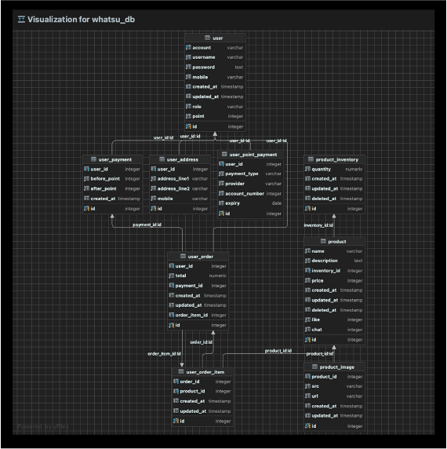 <br>
<BR>

## 💻 프로젝트 구현

### [ 계정 ]
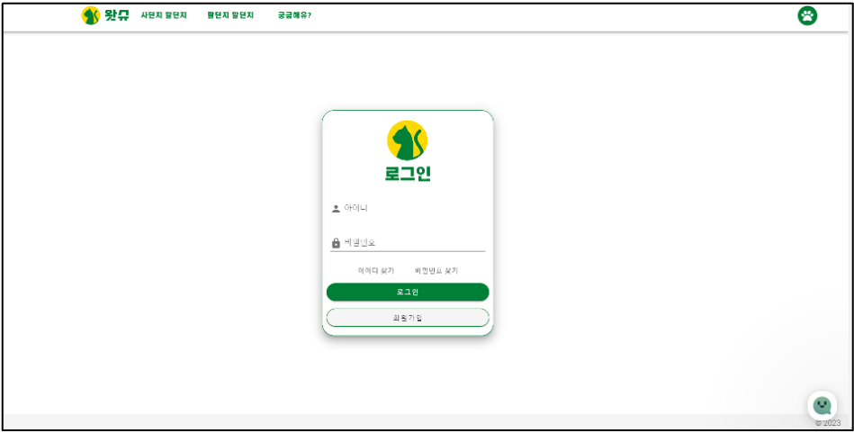
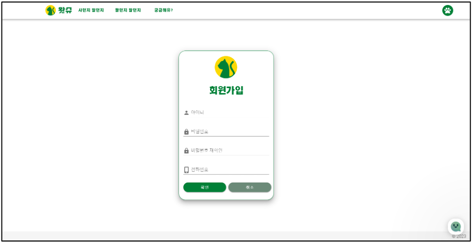
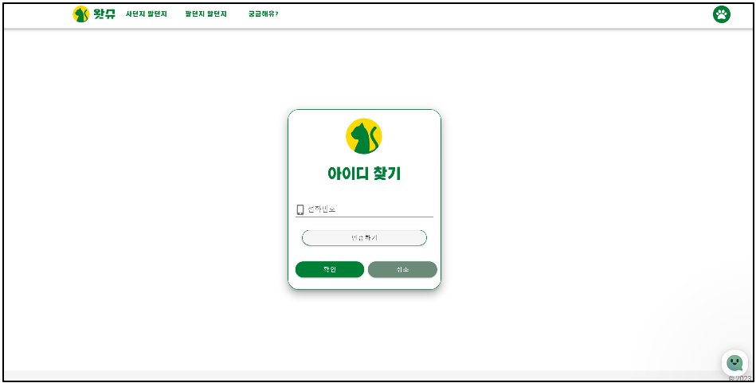
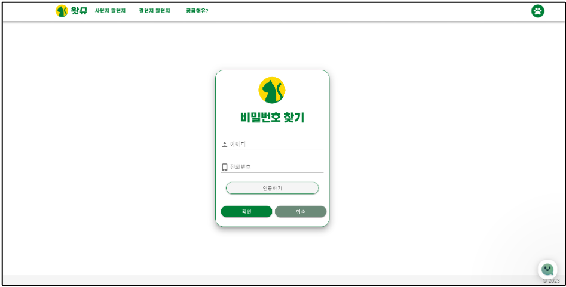
<br>

### [ 메인 ]
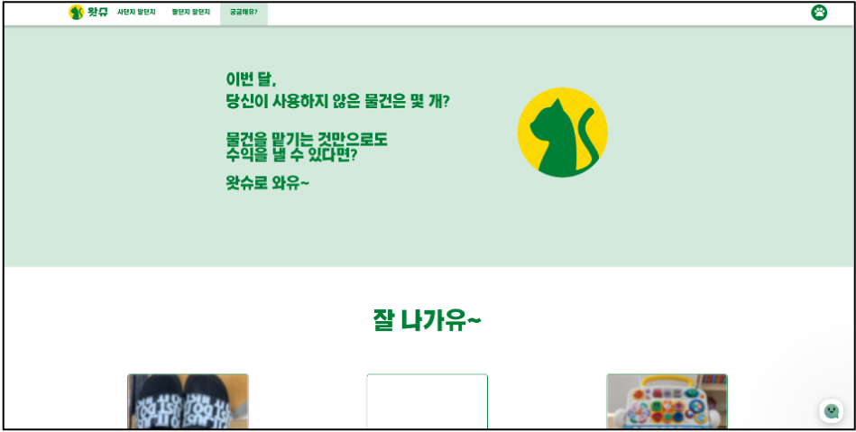
<br>

### [ 게시판 ]
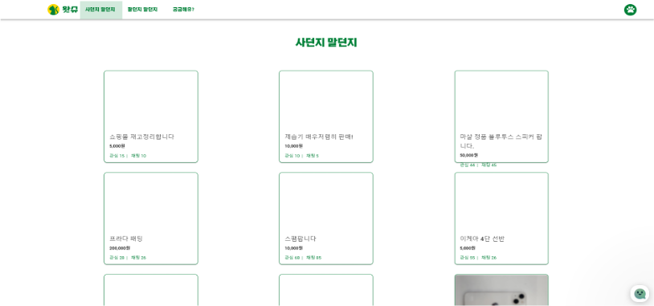
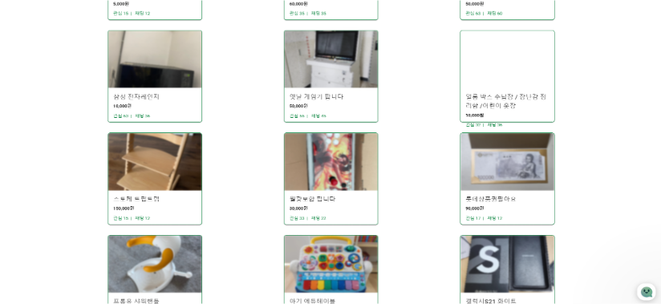
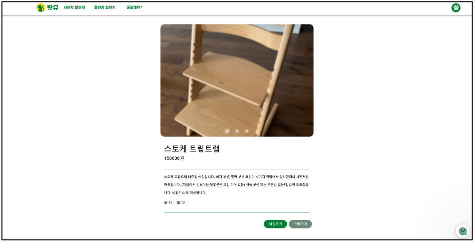
<br>

### [ 판매 게시판 ]
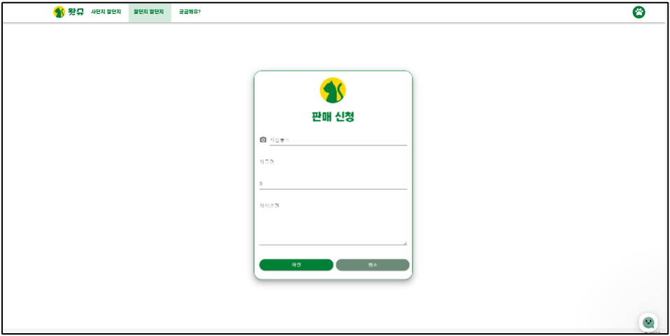
<br>

### [ 마이 페이지 ]
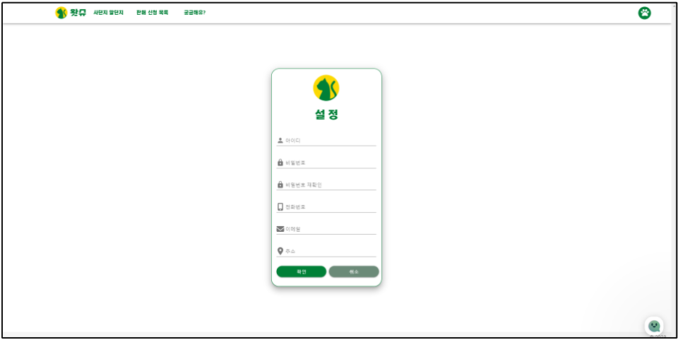
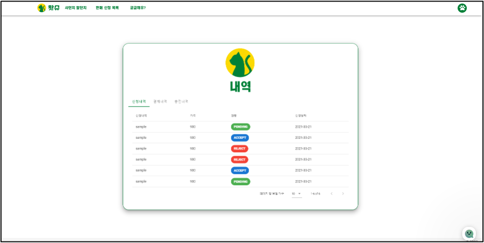
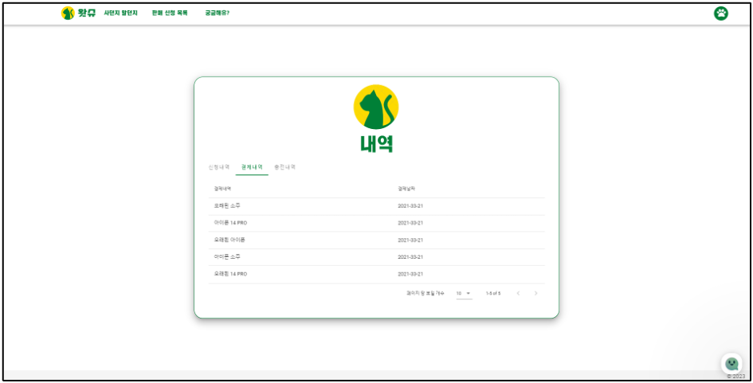
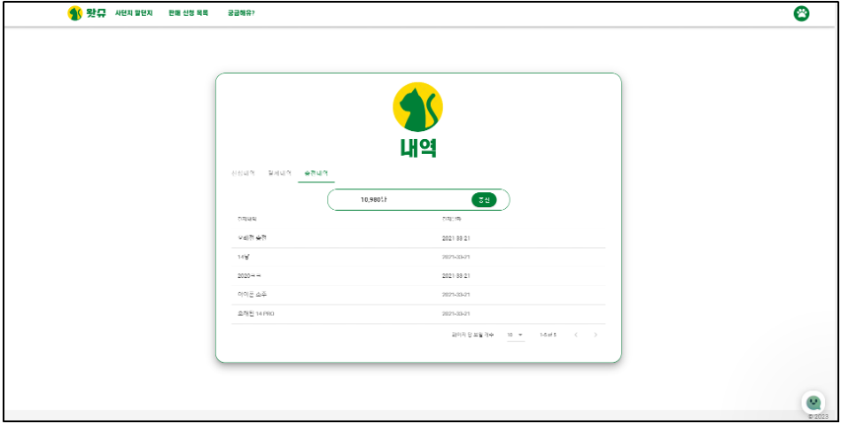
<br>

### [ 결제 ]
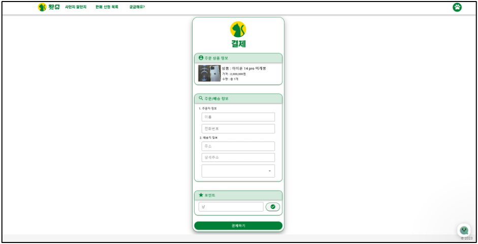
<br>

### [ 문의 ]
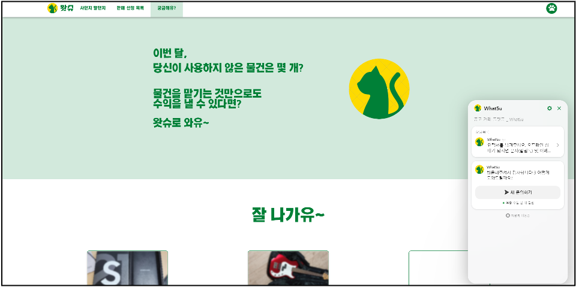
<br>

### [ 에러 페이지 ]
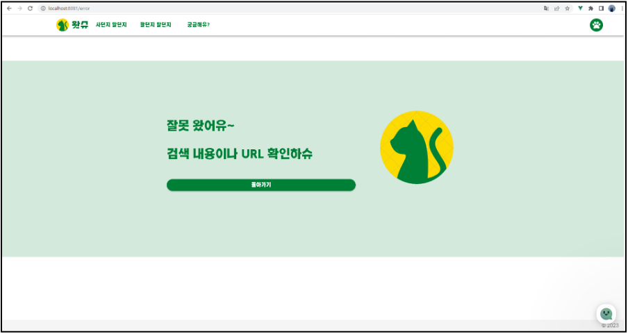
<br>
<hr>
<Br>

<hr>

## Project setup
```
npm install
```

### Compiles and hot-reloads for development
```
npm run serve
```

### Compiles and minifies for production
```
npm run build
```

### Lints and fixes files
```
npm run lint
```

### Customize configuration
See [Configuration Reference](https://cli.vuejs.org/config/).
